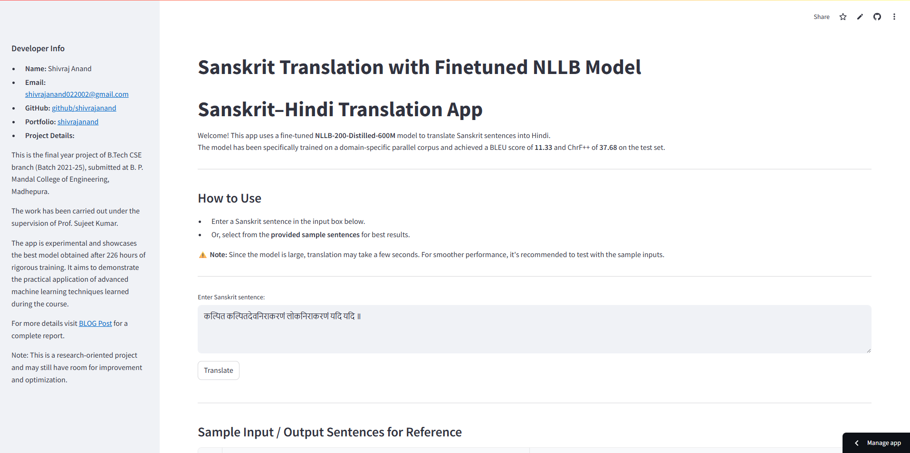
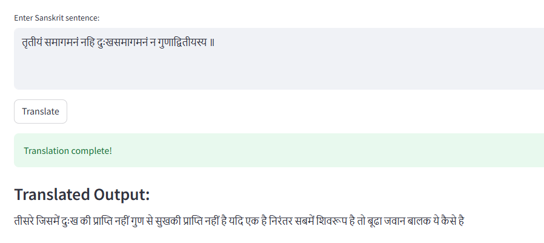

# Sanskrit–Hindi Translation App

## 🔤 Powered by Finetuned NLLB-200-Distilled-600M

This app translates Sanskrit sentences into Hindi using a fine-tuned NLLB-200-Distilled-600M model. The model was specifically trained on a domain-specific parallel corpus.

### 🚀 Performance Metrics
- **BLEU Score**: 11.33
- **ChrF++ Score**: 37.68

### 🧠 Key Features
- Translates Sanskrit input to Hindi using a transformer-based model.
- Trained for 60 epochs on a custom Sanskrit–Hindi parallel corpus.
- Substantial performance boost over zero-shot baselines.
- Handles morphologically rich and linguistically complex input.

### Screenshots

### 💡 How to Use
1. Enter a Sanskrit sentence in the input box.
2. Or, select from the provided sample sentences for best results.

⚠️ Note: Translation may take a few seconds due to the model size.

⚠️ Note: It is highly possible that a random sentence might be wrongly translated since the model was trained on a relatively low size corupus which was very specific to it's field.

### 👨‍💻 Developer Info
- **Name**: Shivraj Anand
- **Email**: shivrajanand022002@gmail.com
- **GitHub**: [shivrajanand](https://github.com/shivrajanand)
- **Portfolio**: [shivrajanand.github.io](https://shivrajanand.github.io)

### 📚 Project Details
This is the final year B.Tech project (Batch 2021–25) from B. P. Mandal College of Engineering, Madhepura, under the guidance of **Prof. Sujeet Kumar**.

The app showcases the best model obtained after **226 hours** of training. It demonstrates the practical application of advanced machine learning techniques.

> This is a research-oriented project and may still have room for improvement and optimization.

### 📄 Project Abstract
The project “Finetuning NLLB-200-Distilled-600M for Sanskrit to Hindi Translation” addresses the challenges of translating between low-resource, grammatically complex languages. The model was fine-tuned on an in-house corpus and significantly outperformed baselines.

- **Zero-shot BLEU/ChrF++ scores**: 0–1 / <2
- **Post-finetuning scores**: BLEU 11.33 / ChrF++ 37.68

This project highlights the importance of task-specific training and quality datasets for improving translation quality in multilingual models.

### 🔗 Resources
- **DATASET**: The dataset utilized in this project was supplied by the project supervisor solely for
academic use. It was manually compiled, and all rights are owned by IIT Kharagpur.
Due to confidentiality constraints, the dataset cannot be disclosed, as it has not yet been
publicly released by the institute.
- **Code**: [GitHub](https://github.com/shivrajanand/FinalYearProjectBtech)
- **Blog Post**: [shivrajanand.github.io](https://shivrajanand.github.io/blog_pages/FinalYearproject/finalyearproject.html)
